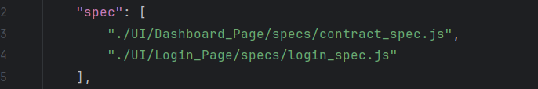

# Test task
Greeting! 
Before you start this project, make sure:
1) You have installed NodeJs v. 20
2) You have installed NPM

To start this project:
1) Run 'npm i' command
2) Make sure every package was installed correctly

Commands to start test's run:
1) npm run test:ui - for run UI's tests
3) npm run test:api - for run API's tests

4) npm run report:generate - for generate Allure report
5) npm run report:open - for open Allure report 

If you wanna run separately "Dashboard" or "Login" spec, you should commit or delete spec, what you won't use in mocha_ui_config.json

A little bit about frameworks choose:
1) "allure-mocha" - for allure report
2) "axios": "^1.3.0" - for HTTP requests, for API in tests
3) "chai": "^5.1.1" - for asserts in tests
4) "mocha": "^10.7.3" - for async test and work with Chai
5) "mocha-allure-reporter": "^1.4.0" - for work allure and mocha together
6) "prettier": "^3.3.3" - automatic code formater for easier debugger
7) "selenium-webdriver": "^4.23.0" - standard library for automation tests
8) "webdriver-manager": "^12.1.9" - support tool for selenium
9) "playwright": "^1.46.1" - for API tests

Thanks for your attention. If you have any questions or blockers, please let me know!
Hope, my skill it's what you a looking.
Have a nice day :)